Aquí encontrarás recursos paso a paso para que puedas **aprender a programar con R desde cero!**

- ¿Estás pensando en [aprender a programar para analizar datos?](#introduccion)
- ¿Nunca has programado, pero [quieres empezar ya?](#basico)
- ¿Sabes un poco de R, pero [necesitas mejorar?](#intermedio)
- ¿Buscas [cursos gratuitos de R?](#cursos)
- ¿Ya sabes R y [quieres seguir avanzando?](#avanzado)
- ¿Quieres [conectar con otros/as usuarios/as de R y crear comunidad?](#conecta)

------------------------------------------------------------------------

## ¿Por qué aprender R?

R es un lenguaje **diseñado para el análisis de datos**, hecho para personas sin mucha experiencia en programación, y con una gran comunidad!

**Gratuito**

R es un lenguaje de programación abierto y gratuito, y es parte de la comunidad del *software libre*, así que nunca tendrás que pagar nada!

**Amigable**

R fue creado para personas de distintas disciplinas, y al centrarse en los datos resulta [más intuitivo](https://bastianolea.rbind.io/blog/r_introduccion/por_que_r/#usabilidad) que otros lenguajes.

**Reproducible**

La gracia de R es [guardar todos los pasos de tu análisis](https://bastianolea.rbind.io/blog/2025-11-13/), lo que facilita corregirlos, [reutilizarlos](https://bastianolea.rbind.io/blog/r_introduccion/por_que_r/#procesos-reutilizables) para nuevos casos, y compartirlo con otros.

- Leer más sobre la [reproducibilidad](https://atelierdecodigo.com/posts/reproducibilidad.html)
- Leer más sobre [por qué programar en R](https://atelierdecodigo.com/posts/r-humanidades-aprender.html)

------------------------------------------------------------------------

##  Obtener R

Para empezar a analizar datos con R necesitas 1 instalar R (el lenguaje) y 2 instalar RStudio (el programa que usarás) u otra IDE.

1

**Descargar R**

Primero hay que instalar el lenguaje R, que es el programa que permitirá que tu computador entienda el lenguaje R.

R se descarga desde el sitio oficial del [Proyecto R](https://cran.r-project.org).

Para más información [lee esta guía](https://bastianolea.rbind.io/blog/r_introduccion/instalar_r/).

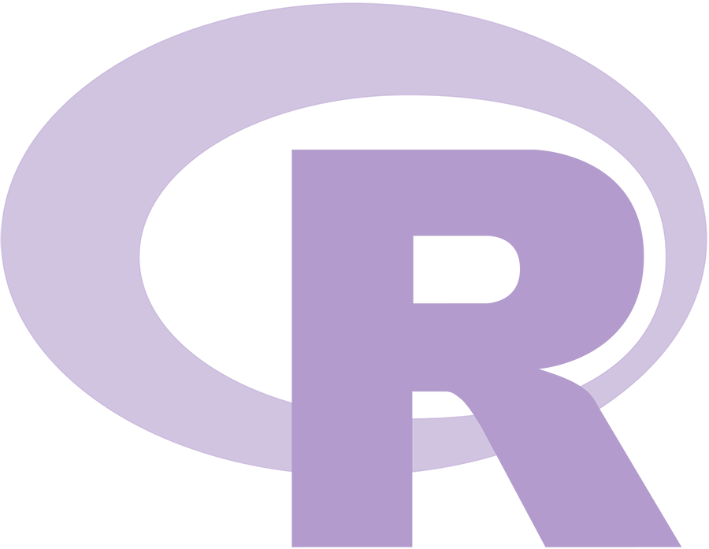

[**Descargar** ](https://cran.r-project.org)

2

**Descargar una IDE**

Una vez que tengas R instalado, necesitas un programa que te ayude a usarlo.

A esto se le denomina [IDE o *entorno de desarrollo*](https://atelierdecodigo.com/posts/entorno-desarrollo-integrado-ide.html), y las 2 más populares son [RStudio](https://posit.co/download/rstudio-desktop/) y [Positron](https://posit.co/products/ide/positron/).

**RStudio**

[Descargar ](https://posit.co/download/rstudio-desktop/)

**Positron**

[Descargar ](https://posit.co/products/ide/positron/)

Opcionalmente, puedes usar R en la nube mediante servicios como [Posit Cloud,](https://posit.cloud) que te permite usar RStudio en un navegador gratis.

------------------------------------------------------------------------

## Primeros pasos en R

En esta sección están los contenidos básicos para aprender R, empezando desde lo más fundamental y avanzando paso a paso.

Cubriendo todos estos contenidos podrás formarte de manera autodidacta en poco tiempo!

#### Introducción al lenguaje R

Para empezar, vamos a [aprender desde cero](https://bastianolea.rbind.io/blog/r_introduccion/r_basico/) a trabajar con datos en R, empezando con las operaciones más básicas, para prepararte a trabajar con datos reales.

Contenidos:

- [Conoce RStudio](https://bastianolea.rbind.io/blog/r_introduccion/r_basico/#rstudio)
- [Proyectos de R](https://bastianolea.rbind.io/blog/r_introduccion/proyectos/)
- [Operaciones básicas en R](https://bastianolea.rbind.io/blog/r_introduccion/r_basico/#primeras-operaciones-en-r)
- [Vectores de datos](https://bastianolea.rbind.io/blog/r_introduccion/r_basico/#vectores)
- [Funciones básicas](https://bastianolea.rbind.io/blog/r_introduccion/r_basico/#funciones)
- [Conectores o *pipes* (`|>` y `%>%`)](https://bastianolea.rbind.io/blog/r_introduccion/conectores/)

RStudio

conoce el programa donde analizarás tus datos con R

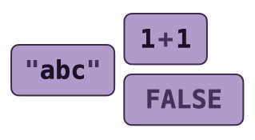

Operaciones

aprende las operaciones básicas y los tipos de datos

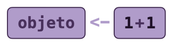

Asignación

aprende a crear objetos, una de las acciones principales en R

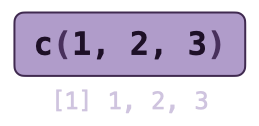

Vectores

conoce uno de los objetos más importantes de R: las secuencias de datos

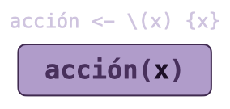

Funciones

las funciones reciben datos y entregan resultados, y son las piezas con las que se contruye todo análisis

Conectores

procesa datos creando pasos consecutivos que van encadenando operaciones de forma lógica y legible

#### Trabajando con datos en R

Ahora que tenemos conocimientos básicos sobre R y la programación, podemos lanzarnos a trabajar con tablas de datos. [Aprenderemos a usar `dplyr`](https://bastianolea.rbind.io/blog/r_introduccion/dplyr_intro/) para explorar y transformar tablas de datos de forma sencilla.

Contenidos:

- [Conoce `{dplyr}`](https://bastianolea.rbind.io/blog/r_introduccion/dplyr_intro/)
- [Explorar datos](https://bastianolea.rbind.io/blog/r_introduccion/dplyr_intro/#explorar-una-tabla)
- [Filtrar datos](https://bastianolea.rbind.io/blog/r_introduccion/dplyr_intro/#filtrar-datos)
- [Crear y modificar variables](https://bastianolea.rbind.io/blog/r_introduccion/dplyr_mutate)
- [Cruzar datos (*left join*)](https://bastianolea.rbind.io/blog/left_join/)
- [Limpieza de datos](https://bastianolea.rbind.io/blog/limpieza_tips/)
- [Pivotar datos a formatos largo y ancho](https://bastianolea.rbind.io/blog/r_introduccion/tidyr_pivotar/)

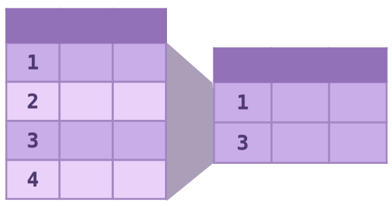

Filtrar datos

extrae subconjuntos de las filas de tus datos, una de las operaciones más recurrentes para limpiar datos o enfocar tu análisis

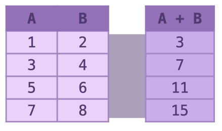

Crear variables

calcula nuevas columnas a partir de variables existentes o usando funciones, y también realiza cálculos por grupos de filas

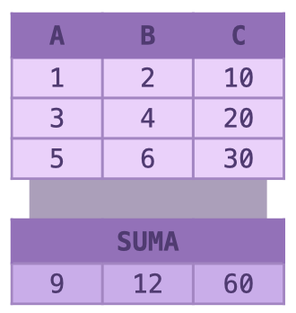

Resumir filas

realiza operaciones sobre varias filas que den como resultado un resumen de una sola fila, o una fila por grupo

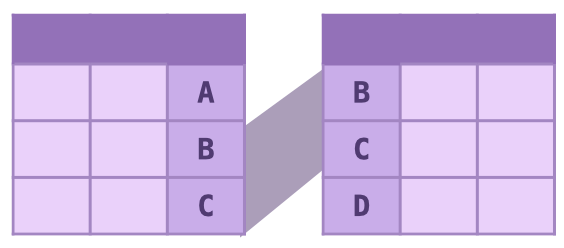

Cruzar tablas

agrega columnas a una tabla desde una segunda tabla cruzándolas por medio de una llave, una columna en común entre ambas tablas que permite la unión

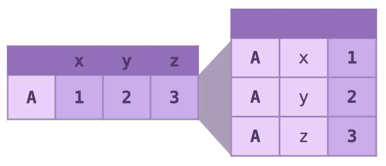

Pivotar tablas

transforma la estructura de tus tablas de datos al llevarlas desde un formato ancho (variables en columnas) a un formato largo (variables en filas), o viceversa

#### Programación básica con R

Este paso es *opcional*, pero se recomienda [conocer las funcionalidades principales](https://bastianolea.rbind.io/blog/r_introduccion/r_intermedio/) de cualquier lenguaje de programación. Aprendiendo funciones, condicionales y *loops* podrás ahorrar tiempo y automatizar trabajo.

Contenidos:

- [Crear funciones](https://bastianolea.rbind.io/blog/r_introduccion/r_intermedio/#crear-funciones)
- [Condicionales o if](https://bastianolea.rbind.io/blog/r_introduccion/r_intermedio/#control-de-flujo)
- [Loops (*for*) o bucles](https://bastianolea.rbind.io/blog/r_introduccion/r_intermedio/#bucles)

#### Visualización de datos con R

La visualización de datos es una habilidad fundamental, tanto para las fases de exploración y el análisis, como para la presentación y difusión de resultados. [Aprende a usar `{ggplot2}`](https://bastianolea.rbind.io/blog/r_introduccion/tutorial_visualizacion_ggplot/), la librería de visualización más flexible y completa.

Contenidos:

- [Tutorial inicial de `{ggplot2}`](https://bastianolea.rbind.io/blog/r_introduccion/tutorial_visualizacion_ggplot/)
- [Aplicar temas básicos de colores](https://bastianolea.rbind.io/blog/ggplot_temas/)
- [Tipografías personalizadas](https://bastianolea.rbind.io/blog/ggplot_tipografias/)
- [Unir y combinar gráficos](https://bastianolea.rbind.io/blog/patchwork/)
- [Gráficos interactivos](https://bastianolea.rbind.io/blog/ggiraph/)
- [Creación de temas personalizados](https://themockup.blog/posts/2020-12-26-creating-and-using-custom-ggplot2-themes/)
- [Automatizar gráficos en serie](https://bastianolea.rbind.io/blog/ggplot_purrr/)
- [Nubes de palabras](https://bastianolea.rbind.io/blog/nubes_de_palabras/)
- [Visualización de mapas y datos espaciales](https://bastianolea.rbind.io/blog/mapas_sf/)

------------------------------------------------------------------------

##  Paquetes principales

Los [paquetes](https://atelierdecodigo.com/posts/r-base-tidyverse.html) son conjuntos de funciones, datos y documentación que te permiten extender R. Sirven para hacer cosas nuevas o facilitar tu trabajo.

Aquí destacamos algunos de los paquetes más usados en R para análisis de datos, principalmente parte del [Tidyverse](https://tidyverse.org) (un conjunto de paquetes diseñados para la ciencia de datos).

[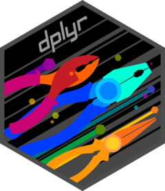](https://dplyr.tidyverse.org)

dplyr

Exploración, manipulación y transformación de tablas de datos en lenguaje amigable

tidyr

Limpieza y ordenamiento de datos, enfocado en producir datos ordenados (tidy data)

[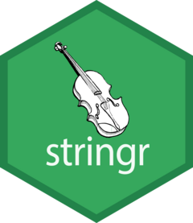](https://stringr.tidyverse.org)

stringr

Trabajar con datos en formato texto, manipulación de texto, y expresiones regulares (regex)

forcats

Variables categóricas u ordinales, muy comunes en datos sociales, en especial para visualizaciones

[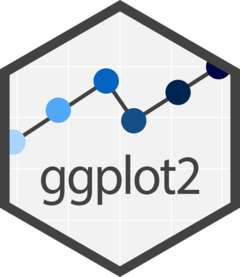](https://ggplot2.tidyverse.org)

ggplot2

Visualización de datos personalizable, basado en una gramática de gráficas

lubridate

Trabajar con datos en formato fecha, incluyendo fecha y hora, zonas horarias, etc.

[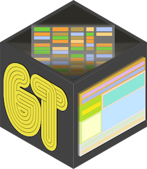](https://gt.rstudio.com)

gt

Creación de tablas atractivas y profesionales, con alta capacidad de personalización

shiny

Creación de aplicaciones web de ciencia de datos, mezclando R con HTML, CSS y JavaScript

sf

Trabajar con datos espaciales y geográficos, generar mapas, operaciones geométricas y más

[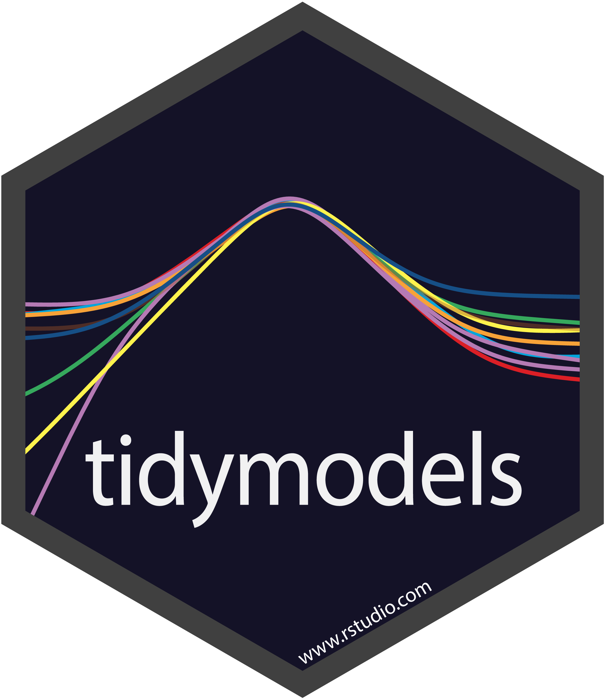](https://www.tidymodels.org)

tidymodels

Modelamiento estadístico, inferencia, machine learning y más gracias a una colección de paquetes

Visita la documentación de cada paquete para aprender a usarlos y profundizar.

------------------------------------------------------------------------

## Ayudas

##  Ayudas para aprender R

Algunos recursos para facilitar tu aprendizaje:

- [Hojas oficiales de apuntes y trucos para R](https://posit.co/resources/cheatsheets/), que sirven como referencia de las funciones principales de cada paquete
- [Asistente de IA `{gander}` para RStudio](https://bastianolea.rbind.io/blog/gander/), que puedes invocar desde tus scripts para que te escriba o corrija código en casos puntuales
- [Chat interactivo de IA `{btw}` para RStudio](https://bastianolea.rbind.io/blog/btw/), que tiene conocimientos sobre tus datos, la documentación oficial de los paquetes, y más, para obtener mejores respuestas
- [Autocompletado de código con IA en RStudio](https://bastianolea.rbind.io/blog/github_copilot/), que te ayuda y te ahorra tiempo al intentar completar lo que estás escribiendo
- [El paquete `datos`](https://cienciadedatos.github.io/datos/) cuenta con muchos conjuntos de datos orientados al aprendizaje traducidos al español
- [StackOverflow de R](https://stackoverflow.com/collectives/r-language), donde puedes hacer preguntas
- [Sitios web y otros recursos para aprender R](https://bastianolea.rbind.io/blog/r_introduccion/recursos_r/#aprender)

------------------------------------------------------------------------

##  Apuntes

Hojas que resumen todo lo que necesitas, por si olvidas algo o necesitas refrescar tu memoria. Sirven para recordar rápido algo sin tener que entrar a la documentación completa.

[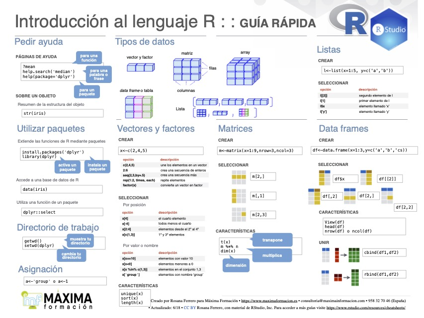](pdf/introduccion-a-r.pdf)

Introducción a R

Recordatorios básicos de conceptos principales

[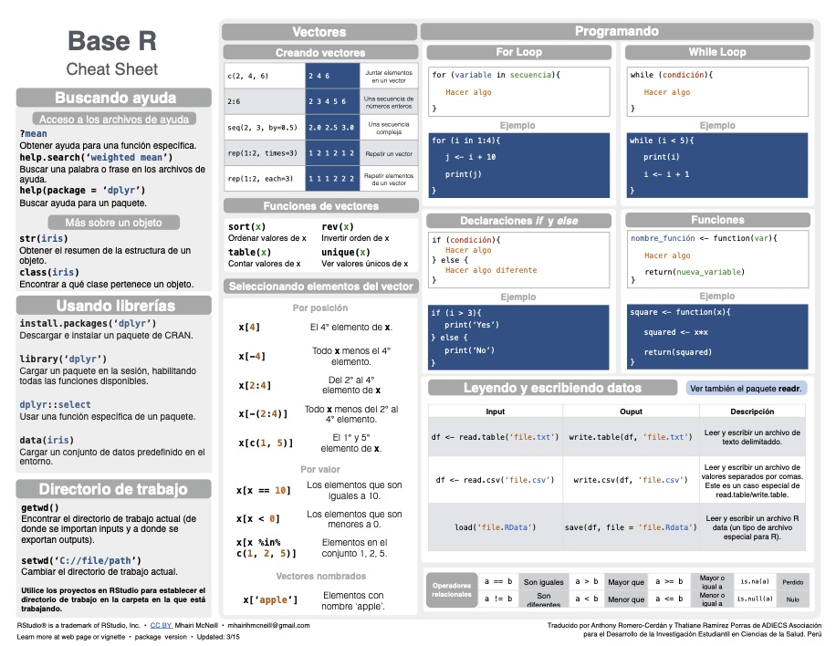](pdf/base-r_es.pdf)

Base R

Conceptos básicos para usar R en la práctica

[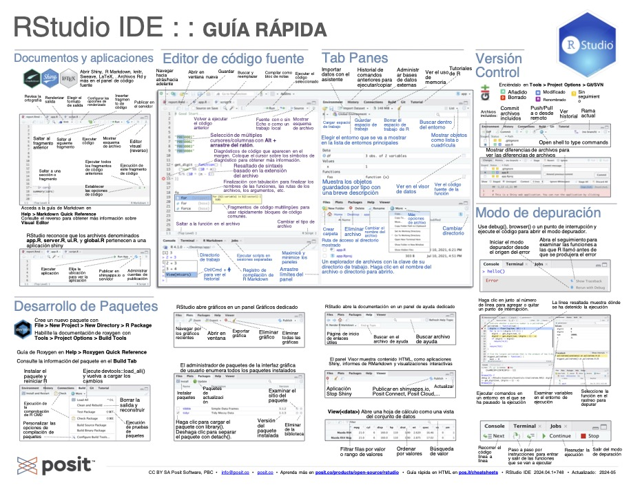](pdf/rstudio-ide_es.pdf)

RStudio

Aspectos principales del entorno de desarrollo RStudio

[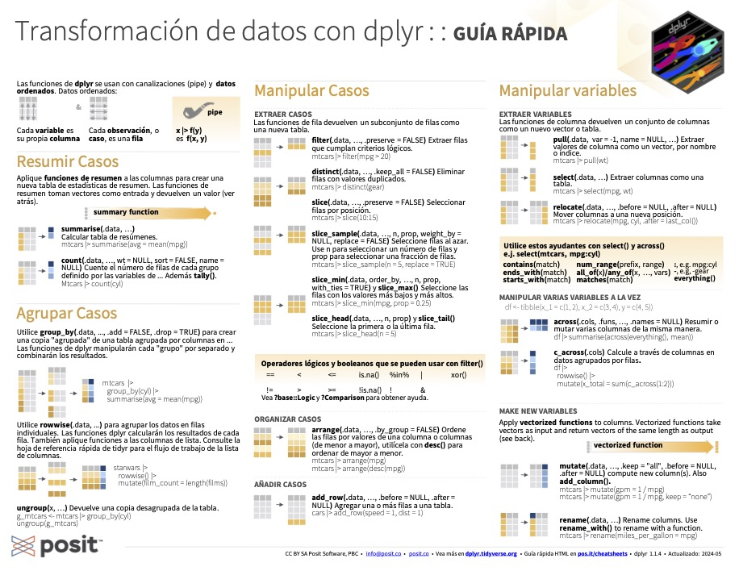](pdf/data-transformation_es.pdf)

Dplyr

Transformación y manipulación de datos con `dplyr`

[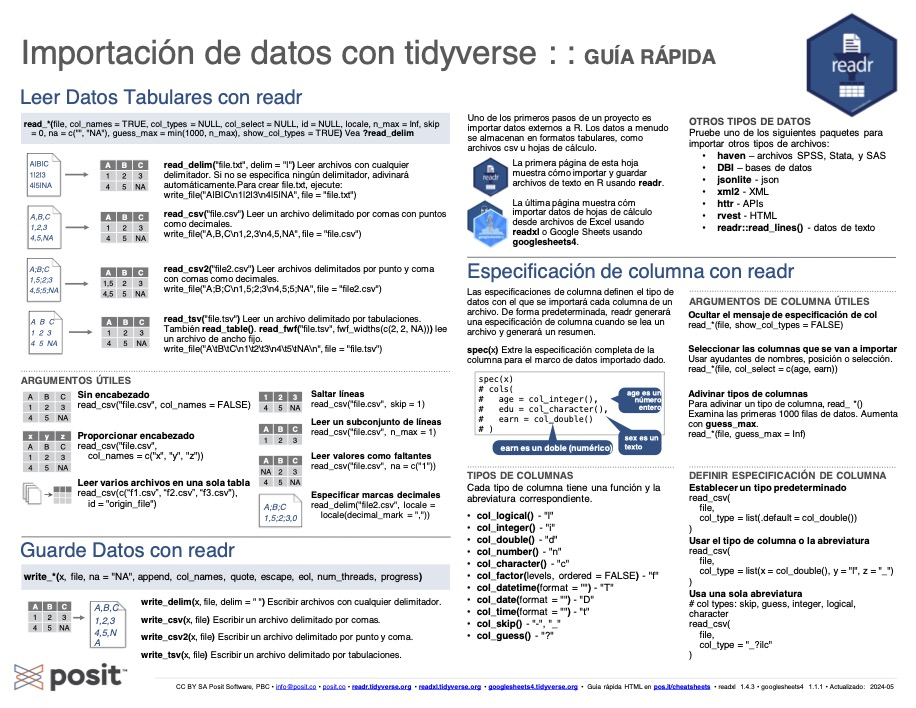](pdf/data-import_es.pdf)

Importar datos

Carga datos desde CSV, Excel y Google Drive

[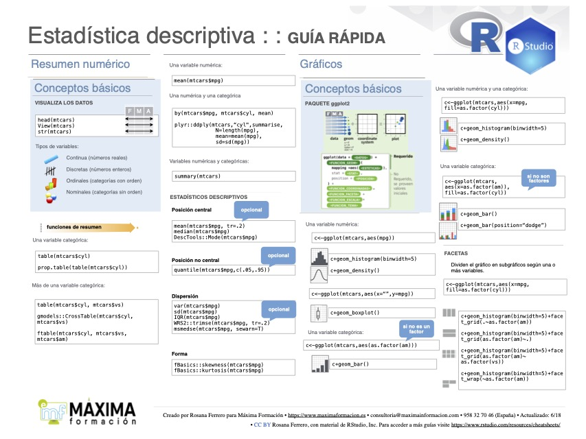](pdf/estadistica-descriptiva-con-R.pdf)

Estadísticas descriptivas

Estadísticas descriptivas básicas

[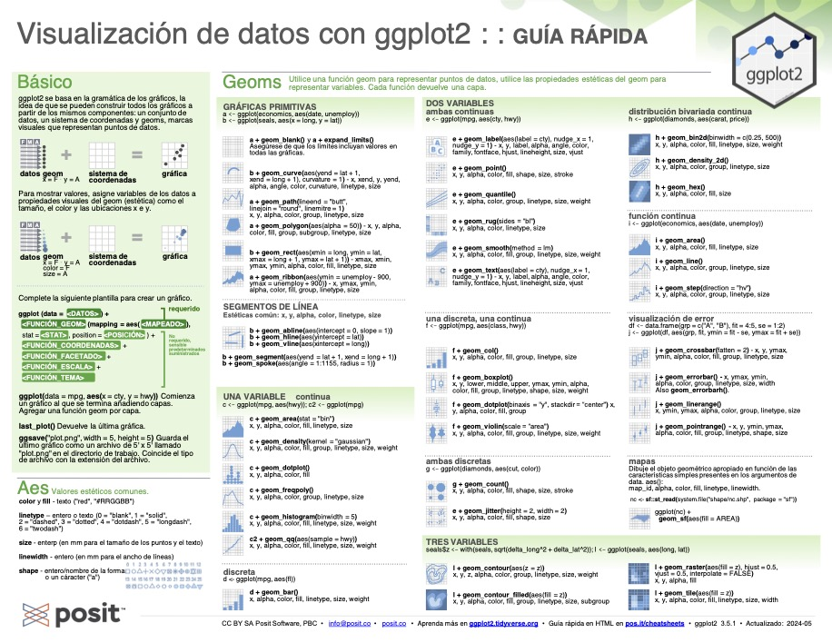](pdf/data-visualization_es.pdf)

Visualización

Visualización de datos con `ggplot2`

[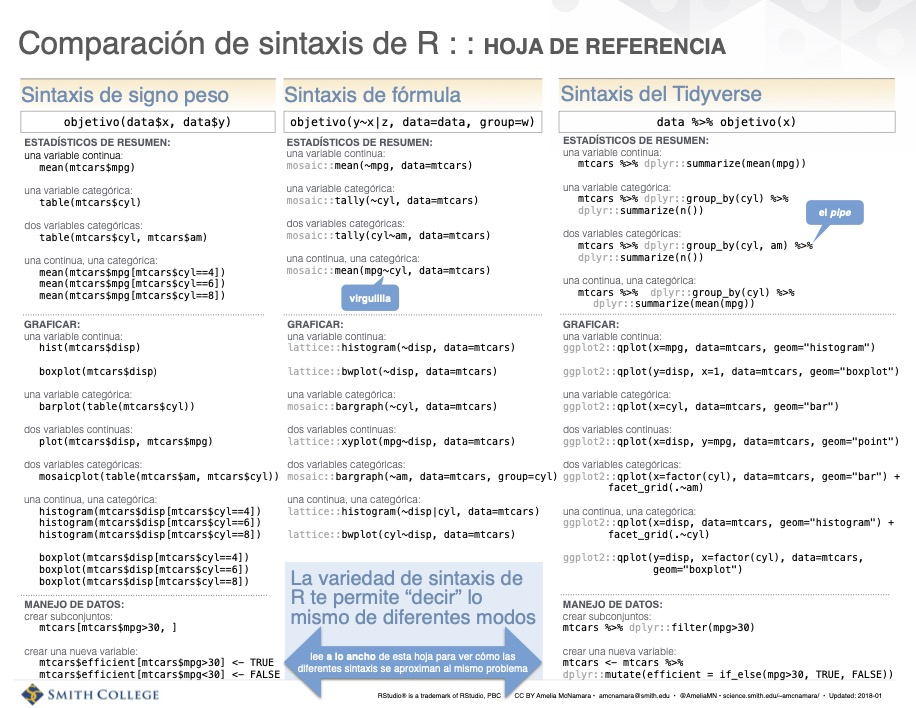](pdf/syntax_es.pdf)

Sintaxis de R

Compara distintas formas de hacer lo mismo

[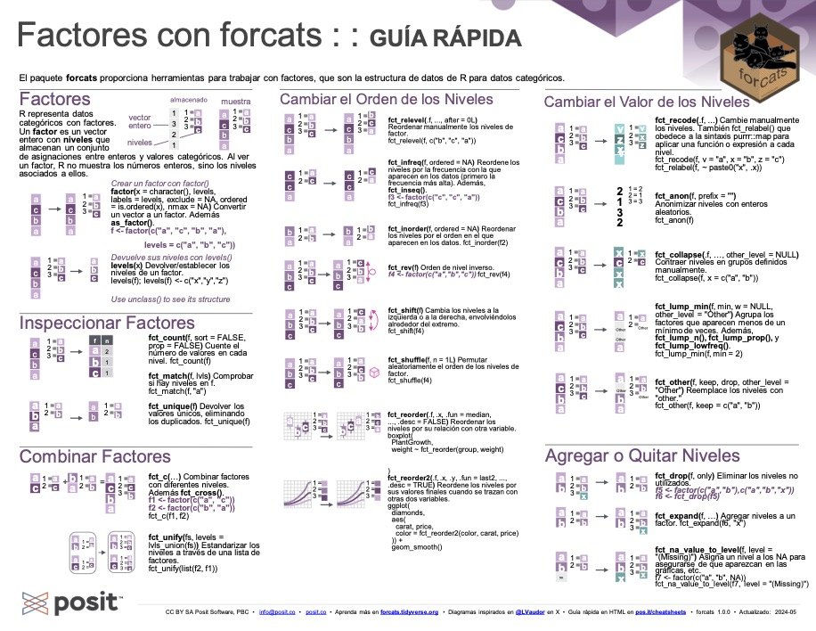](pdf/factors_es.pdf)

Factores

Trabaja con datos en formato factor con `forcats`

[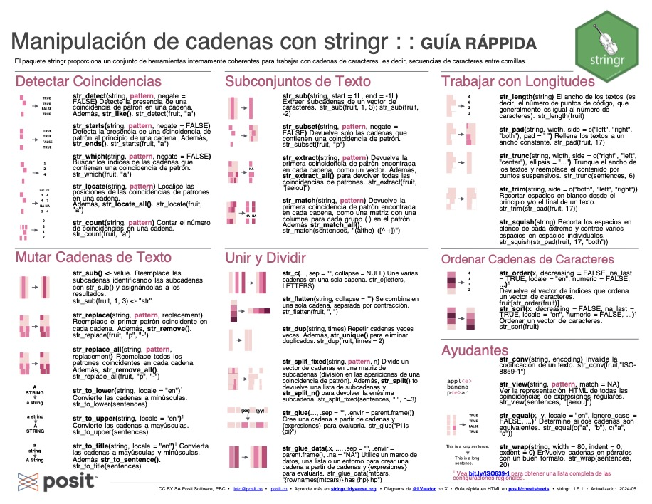](pdf/strings_es.pdf)

Texto

Trabaja con datos en formato de texto con `stringr`

[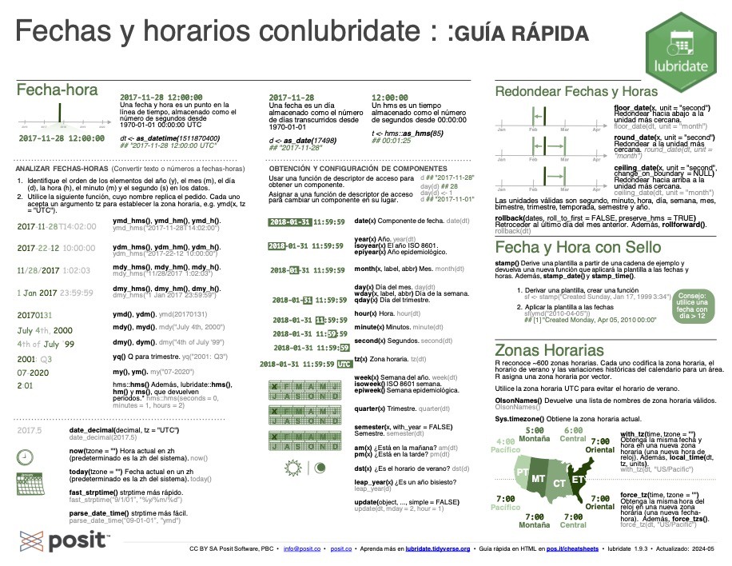](pdf/lubridate_es.pdf)

Fechas

Trabaja con datos en formato fecha y hora con `lubridate`

[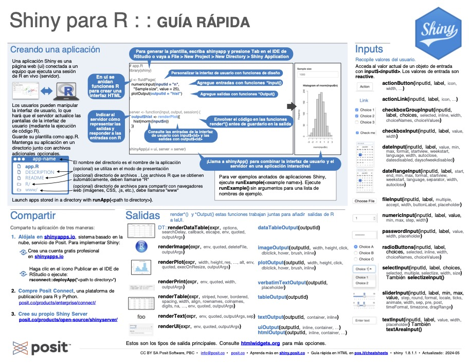](pdf/shiny_es.pdf)

Shiny

Desarrollo de aplicaciones web interactivas centradas en datos

Revísalas todas en el [sitio oficial de Posit](https://posit.co/resources/cheatsheets/)!

------------------------------------------------------------------------

##  Libros recomendados

Lecturas para aprender R de manera más completa, profundizando en aspectos del lenguaje o en su aplicación a distintas disciplinas.

[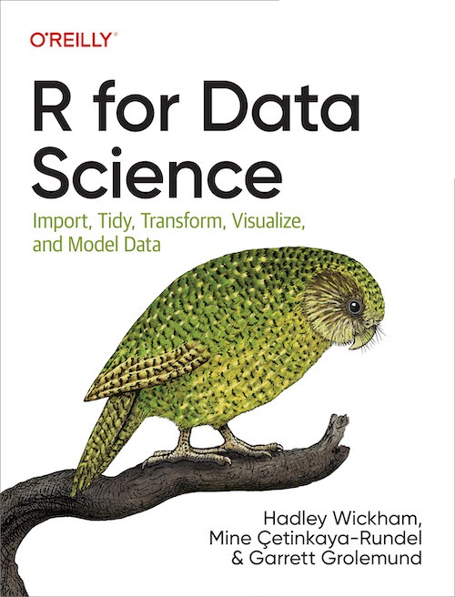](https://es.r4ds.hadley.nz)

R para ciencia de datos en español

Libro central para aprender a usar R, escrito por uno de los desarrolladores principales de R, y traducido al español por la comunidad.

Fundamentos de ciencia de datos con R

Libro enfocado en ciencia de datos aplicada. Empieza por lo básico y avanza por temas como estadísticas, modelamiento, datos espaciales y redes neuronales.

Gran libro de R

No es exactamente un libro, sino una enorme colección de libros que usan R para todos los campos de estudio y disciplinas imaginables. Se mantiene en constante expansión.

------------------------------------------------------------------------

##  Cursos

Clases grabadas o interactivas para aprender R de forma más estructurada.

[Introducción al análisis de datos con R para ciencias sociales, 3ª versión](https://bastianolea.rbind.io/clases/curso_r_intro_3/) grabación

Curso grabado de programación para estudiantes o profesionales de ciencias sociales sin experiencia en programación. En 4 clases aprendemos a usar R desde cero con datos reales, pasando por las operaciones principales del análisis de datos, y terminando con una introducción a la visualización de datos con R.

[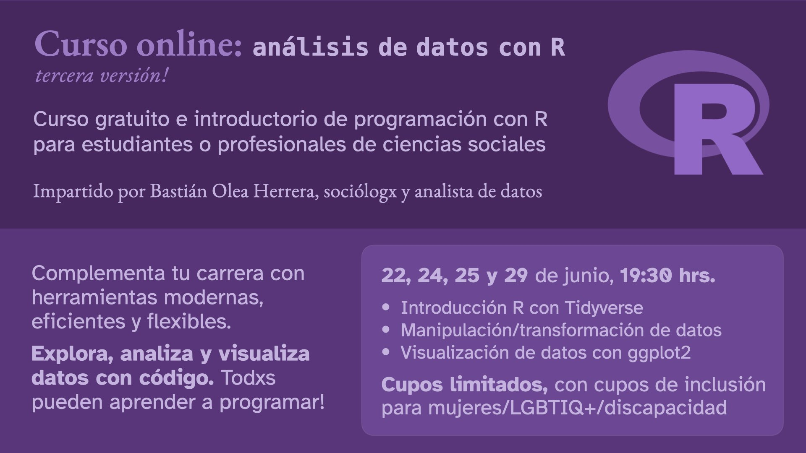](https://bastianolea.rbind.io/clases/curso_r_intro_3/)

[Instituto Nacional de Estadísticas](https://www.ine.gob.cl/ine-educa/clases-r/capsulas-basicas/introduccion-al-uso-de-r) grabación

Diapositivas y videos gratuitos que parten desde lo más básico, impartidos por profesionales del INE. También tienen clases de [temas más avanzados](https://www.ine.gob.cl/ine-educa/clases-r/clases-sobre-topicos-intermedios), como procesamiento de lenguaje natural y conexión a base de datos.

[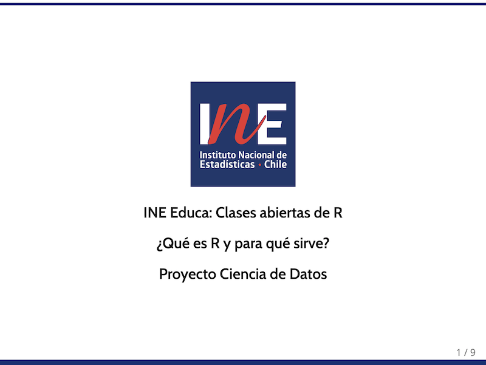](https://www.ine.gob.cl/ine-educa/clases-r/capsulas-basicas/introduccion-al-uso-de-r)

[edX](https://www.edx.org/es/aprende/programacion-r) gratis

Cursos gratutos en español impartidos por varias universidades, incluyendo ciencia de datos con R, análisis de datos empresariales con R, y más. Tiene fecha límite para completarlos y se puede pagar por certificación.

[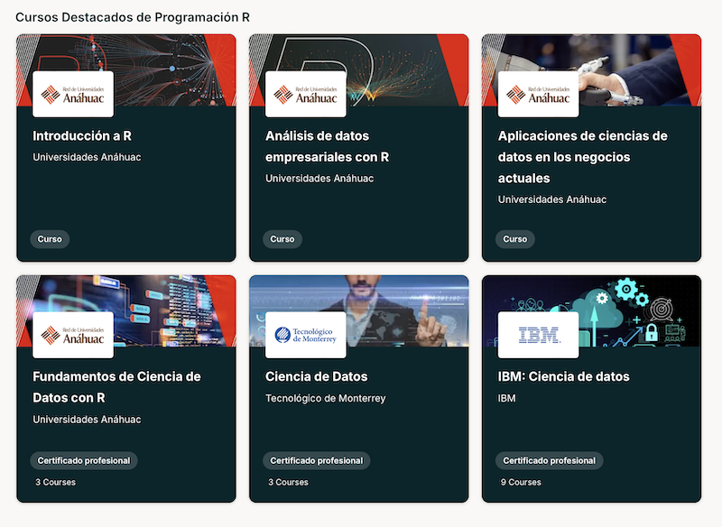](https://www.edx.org/es/aprende/programacion-r)

[Conferencias y talleres de posit::conf(2025)](https://posit.co/blog/talks-and-workshops-from-posit-conf-2025/) grabación

Colección completa de conferencias, charlas y talleres impartidos en la conferencia anual de [Posit](https://posit.co), incluyendo 4 *keynotes* y más de 100 charlas sobre R y ciencia de datos.

[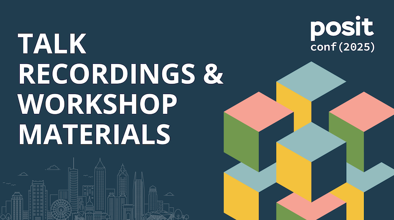](https://posit.co/blog/talks-and-workshops-from-posit-conf-2025/)

¿Conoces algún curso gratuito y completo de R en español? [Por favor avísame](https://bastianolea.rbind.io/contacto/) para agregarlo!

------------------------------------------------------------------------

## Explora las posibilidades de R

Cuando ya hayas aprendido a trabajar con datos empieza lo bueno: ahora se abre un mundo de posibilidades! ✨

Elige un objetivo o temática y especialízate:

####  Gráficos

- [**Tutorial** de visualización de datos con `ggplot2`](https://bastianolea.rbind.io/blog/r_introduccion/tutorial_visualizacion_ggplot/)
- [Galería de tipos de gráficos con instrucciones](https://r-graph-gallery.com)
- [Ejemplos de gráficos hechos con R](https://r-graph-gallery.com/best-r-chart-examples.html)
- [Combinar gráficos `ggplot2`](https://bastianolea.rbind.io/blog/patchwork/)
- [Gráficos interactivos con `ggiraph`](https://bastianolea.rbind.io/blog/ggiraph/)
- [Extensiones útiles para `ggplot2`](https://bastianolea.rbind.io/blog/ggplot_extensiones/)

Ver más tutoriales de [gráficos](https://bastianolea.rbind.io/tags/visualización-de-datos/)

####  Mapas

- [**Tutorial** de mapas con el paquete `sf`](https://bastianolea.rbind.io/blog/mapas_sf/)
- [R como SIG: Shapefiles, GeoPackages y mapas coropléticos de México](https://alejandroromerog.github.io/blog/RComoSIG-Mapa/)
- [Tutoriales de mapas con R](https://r-graph-gallery.com/map.html)
- [Mapas comunales y regionales de Chile en R](https://bastianolea.rbind.io/blog/tutorial_mapa_chile/)
- [Mapa urbano de la región Metropolitana de Santiago, Chile](https://bastianolea.rbind.io/blog/tutorial_mapa_urbano/)
- [Mapas hexagonales o cuadriculados con R](https://bastianolea.rbind.io/blog/mapas_hexagonales/)
- [Guía práctica de proyecciones de mapas](https://dominicroye.github.io/blog/map-projections/)

Ver más tutoriales de [mapas](https://bastianolea.rbind.io/tags/mapas/)

####  Tablas

- [**Tutorial** de tablas con `gt`](https://bastianolea.rbind.io/blog/tutorial_gt/)
- [Galería de tablas: competencia de tablas 2025](https://posit.co/blog/2025-table-contest-winners/)
- [Libro de cocina de tablas con `gt`](https://themockup.blog/static/resources/gt-cookbook) y su versión [avanzada](https://themockup.blog/static/resources/gt-cookbook-advanced)
- [Tutoriales de tablas en R](https://r-graph-gallery.com/table.html)

Ver más tutoriales de [tablas](https://bastianolea.rbind.io/tags/tablas/)

####  Reportes

- [**Tutorial** de reportes con Quarto](https://bastianolea.rbind.io/blog/quarto_reportes/)
- [Reportes Quarto parametrizados](https://bastianolea.rbind.io/blog/quarto_params/)
- [Reportes online, blogs y sitios web con Quarto](https://bastianolea.rbind.io/blog/tutorial_quarto_github_pages/)

Ver más tutoriales de [reportes](https://bastianolea.rbind.io/tags/quarto/)

####  Aplicaciones

- [**Tutorial** para crear apps con Shiny desde cero](https://bastianolea.rbind.io/blog/shiny/)
- [Aplicaciones Shiny sobre datos sociales](https://bastianolea.github.io/shiny_apps/)
- [Galería de aplicaciones Shiny: ganadores del concurso de Shiny 2024](https://posit.co/blog/winners-of-the-2024-shiny-contest/)
- [Conferencia ShinyConf 2025](https://www.shinyconf.com) (con videos de ponencias)
- [Shiny Assistant](https://shiny.posit.co/blog/posts/shiny-assistant/), crea apps Shiny con IA

Ver más tutoriales de [Shiny](https://bastianolea.rbind.io/tags/shiny/)

####  Web scraping

- [Introducción al web scraping con R](https://bastianolea.rbind.io/blog/r_introduccion/web_scraping/)
- [Scraping con `rvest`](https://bastianolea.rbind.io/blog/tutorial_scraping_rvest/)
- [Scraping con `RSelenium`](https://bastianolea.rbind.io/blog/tutorial_scraping_selenium/)
- [Scraping con `chromote`](https://bastianolea.rbind.io/blog/tutorial_scraping_chromote/)
- [Web scraping con R](https://franciscahernandezcanas.github.io/materiales/web-scraping/webscraping-en-r.html), por Francisca Hernández C.

Ver más tutoriales de [web scraping](https://bastianolea.rbind.io/tags/web-scraping/)

####  Inteligencia artificial

- [Tutorial introductorio al uso de IA en R](https://bastianolea.rbind.io/blog/ellmer/)
- [Crea un chatbot de IA con R con capacidades de análisis de datos](https://bastianolea.rbind.io/blog/shinychat/)
- [Herramientas para usar modelos de lenguaje de gran escala (LLM) en R](https://luisdva.github.io/llmsr-book/es/index.es.html)
- [Análisis de texto con IA en R: resumir, análisis de sentimiento, clasificación](https://bastianolea.rbind.io/blog/introduccion_llm_mall/)
- [Modelos de IA que pueden usar herramientas desarrolladas en R](https://bastianolea.rbind.io/blog/herramientas_llm/)
- [IA con capacidad de consulta de documentos (RAG) en R](https://bastianolea.rbind.io/blog/rag_ragnar/)
- [*Machine learning* supervisado con R](https://cdr-book.github.io/cap-arboles.html)
- [*Machine learning* no supervisado con R](https://cdr-book.github.io/cap-cluster.html)

Ver más tutoriales de [inteligencia artificial](https://bastianolea.rbind.io/tags/inteligencia-artificial/)

####  Procesamiento de datos

- [Validación de datos con `{pointblank}`](https://bastianolea.rbind.io/blog/validacion_avanzada/)
- [Crear y conectarse a bases de datos](https://bastianolea.rbind.io/blog/db_supabase/)
- [Procesamiento de datos multiprocesador (*multicore*)](https://bastianolea.rbind.io/blog/furrr_multiprocesador/)
- [Procesamiento de datos de encuesta con factor de expansión](https://bastianolea.rbind.io/blog/casen_introduccion/)

Ver más tutoriales de [procesamiento de datos](https://bastianolea.rbind.io/tags/procesamiento-de-datos/)

####  Publicar

- [Publicar y compartir código en GitHub](https://bastianolea.rbind.io/blog/r_introduccion/tutorial_github/)
- [Crea tu propio blog con Quarto](https://bastianolea.rbind.io/blog/tutorial_quarto_github_pages/#blogs-quarto-en-github-pages)
- [Publicar aplicaciones Shiny en internet](https://bastianolea.rbind.io/blog/shiny/#publicar-la-aplicaci%C3%B3n-en-internet)
- [**Taller:** Compartir y colaborar desde el cruce entre las ciencias de datos y las ciencias sociales](https://bastianolea.rbind.io/blog/taller_datos_unam/) (grabación y diapositivas)

------------------------------------------------------------------------

##  Libros avanzados

Libros para **profundizar** mucho más en el lenguaje:

[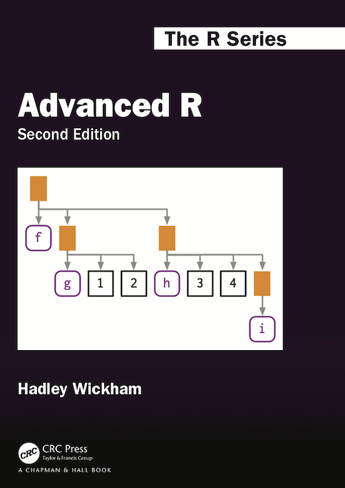](https://adv-r.hadley.nz)

Advanced R

Profundiza en R como lenguaje de programación, más allá de los datos. Indaga en programación orientada a objetos, debugging y más.

[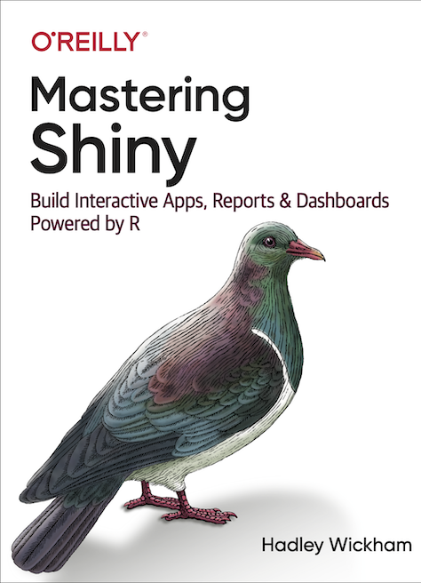](https://mastering-shiny.org)

Mastering Shiny

Guía completa para empezar a desarrollar aplicaciones web con R, partiendo desde lo básico y llegando a lo más avanzado.

The R Inferno

Un libro peculiar sobre dificultades y curiosidades de R. Para entender R como lenguaje de programación desde sus rarezas.

  
Libros sobre **visualización** de datos:

[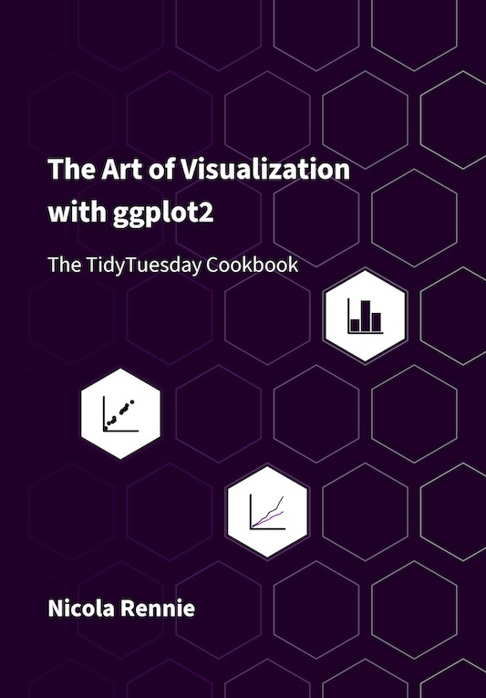](https://nrennie.rbind.io/art-of-viz/)

El arte de la visualización de datos

Libro que explica el proceso tras aproximadamente 150 visualizaciones de datos hechas por [Nicola Rennie](https://nrennie.rbind.io) para el [TidyTuesday](https://github.com/rfordatascience/tidytuesday).

[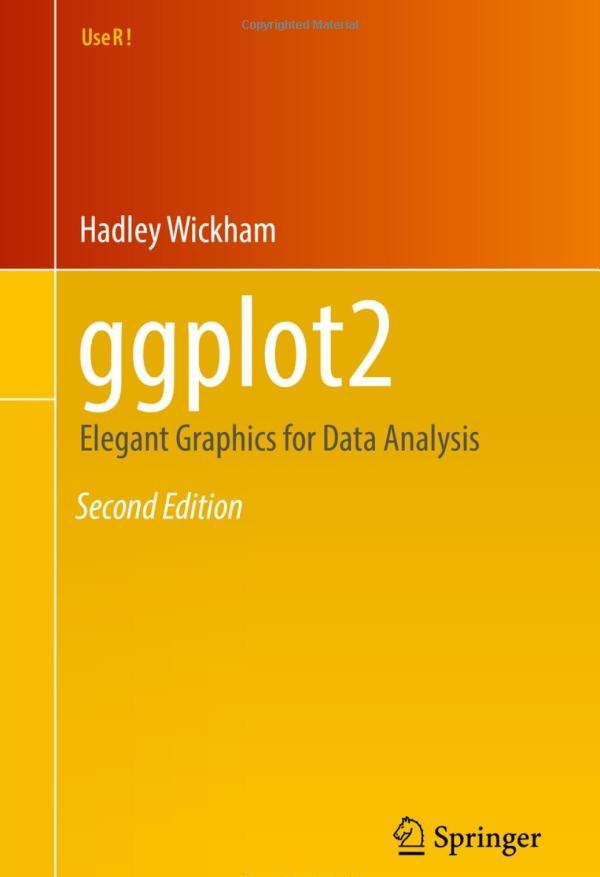](https://ggplot2-book.org)

ggplot2: Elegant Graphics for Data Analysis

Libro que busca explicar la teoría tras este sistema de visualización de datos, en específico la idea de *gramática de gráficas.*

[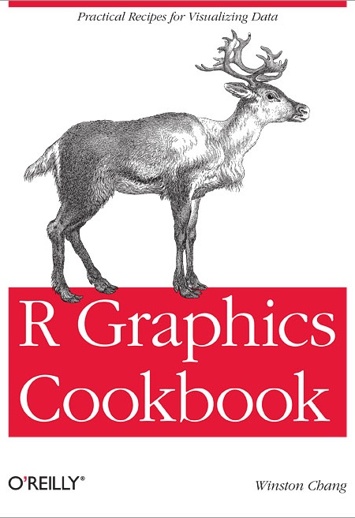](https://r-graphics.org)

R Graphics Cookbook

Más de 150 *recetas* para crear gráficos con R, ordenadas claramente según la necesidad de visualización.

------------------------------------------------------------------------

##  Manténte al día

Conéctate con la comunidad de R para estar al día con noticias, avances, eventos y más!

###  Blogs

- [R-Bloggers](https://www.r-bloggers.com/), blog que reúne cientos de posts desde blogs de usuarios y desarrolladores de R
- [R Weekly](https://rweekly.org), curatoría de noticias y posts sobre R
- [RWorks](https://rworks.dev/), blog de curatoría de funcionalidades y paquetes de R
- [Blog de Posit](https://posit.co/blog/), blog oficial de Posit (antes RStudio)
- [Blog del Tidyverse](https://www.tidyverse.org/blog/)

###  Listas de correo

Suscríbete para recibir noticias sobre R y no quedarte fuera de nada!

- [R for the Rest of Us](https://rfortherestofus.com/whatsnew/)
- [The R Data Scientist](https://rstats.blaze.email)
- [Escuela de Datos](https://substack.com/@escueladedatos)
- [Estación R](https://estacion-r.com/newsletter)
- [Statistics Globe](https://statisticsglobe.com/newsletter)
- [`posit::glimpse()` y otras listas de correo de Posit](https://posit.co/about/subscription-management/)
- [RDM Weekly](https://rdmweekly.substack.com/)
- [Atelier de código](https://atelierdecodigo.com/#newsletter)

¿Conoces una comunidad, blog o lista de correo que no está aquí? [Escríbeme](https://bastianolea.rbind.io/contacto/)

------------------------------------------------------------------------

##  Conéctate con otr@s usuari@s de R

Únete al [Slack de **Aprende R**!](https://join.slack.com/t/aprende-r/shared_invite/zt-3u1bvfzf6-IenbDD_FfXqK6HnbxZdM2Q) Sigue [este enlace](https://join.slack.com/t/aprende-r/shared_invite/zt-3u1bvfzf6-IenbDD_FfXqK6HnbxZdM2Q) para sumarte a un chat grupal dirigido a aprender R en comunidad! Puedes hacer todas tus consultas ahí, compartir tus dudas, y avanzar acompañadx en este camino!

Si eres de Chile 🇨🇱 únete al **nuevo [grupo de usuari@s de R de Santiago!](https://santiagorusers.github.io)** También puede sumarte al [grupo de Slack](https://join.slack.com/t/santiagorusers/shared_invite/zt-3tzmsdyat-gNAUz5mjPij0xFgNLtXeKA) para chatear y conversar!

- [Latin R](https://latinr.org), conferencia Latinoamericana anual de R
- [rainbowR](https://rainbowr.org) 🏳️‍🌈 comunidad de usuarixs de R LGBTIQ+
- [Escuela de Datos](https://escueladedatos.online), comunidad hispanohablante
- [Grupo de usuarios de R de Madrid](https://madrid.r-es.org) 🇪🇸
- [R en Buenos Aires](https://www.meetup.com/renbaires/?_xtd=gqFyqTIxOTE0ODE0MqFwp2FuZHJvaWQ%253D&from=ref) 🇦🇷
- [Comunidad R Hispano](https://r-es.org) 🇪🇸
- Usa el hashtag [\#RStats](https://x.com/hashtag/Rstats) en tu red social favorita!

------------------------------------------------------------------------

## ¡Atrévete!

*¿Todavía no sabes cómo empezar?* [Busca datos](https://bastianolea.github.io/datos_sociales/) sobre un tema que te interese, y atrévete a explorarlo con R! 🔥

Visita [mi blog](https://bastianolea.rbind.io) para más ideas, consejos y tutoriales.

------------------------------------------------------------------------

## Sobre mi

Mi nombre es Bastián Olea Herrera, y soy  
sociólogx y analista de datos.

Estudié sociología y luego hice un magíster, y en el camino descubrí el gusto por los datos, los gráficos y la programación.

Creo en que cualquier persona puede aprender a programar, sin importar su disciplina o área de estudios 😌

Aprendí R de forma autodidacta, siguiendo tutoriales y cursos gratuitos, y por lo mismo me gusta enseñar y ayudar a otrxs a aprender.

Puedes encontrarme en [mi blog](https://bastianolea.rbind.io), en mi [sitio web personal](https://bastimapache.cl), o [contactarme](https://bastianolea.rbind.io/contacto).
